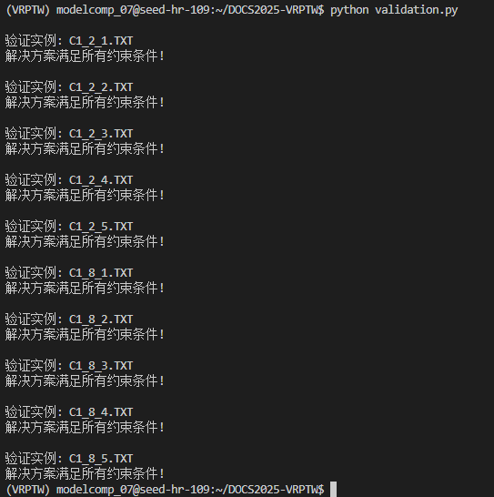
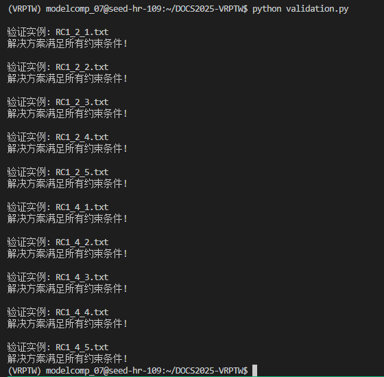

# DOCS2025-VRPTW

Team: Route Seekers

## Experimental Results

- 初赛结果提交[2025/07/24]：具体路径信息放在文件夹 `solutions/results0724` 

  |                           Instance                           | Vehicles (Ours) | Distance (Ours) | Duration (Ours) | Time (Ours) | Rank (Ours) |
  | :----------------------------------------------------------: | :-------------: | :-------------: | :-------------: | :---------: | :---------: |
  | [c1_2_1](https://www.sintef.no/contentassets/67388a7eea5c43cca4f52312c0688142/c1_2_1.txt) |       20        |     2698.6      |     20782.8     |    1800     |      3      |
  | [c1_2_2](https://www.sintef.no/contentassets/67388a7eea5c43cca4f52312c0688142/c1_2_2.18_2917.89.txt) |       18        |     2911.6      |     21244.2     |    1800     |      2      |
  | [c1_2_3](https://www.sintef.no/contentassets/67388a7eea5c43cca4f52312c0688142/c1_2_4.18_2643.31.txt) |       18        |     2701.0      |     21309.5     |    1800     |      2      |
  | [c1_2_4](https://www.sintef.no/contentassets/67388a7eea5c43cca4f52312c0688142/c1_2_4.18_2643.31.txt) |       18        |     2637.2      |     21004.9     |    1800     |      4      |
  | [c1_2_5](https://www.sintef.no/contentassets/67388a7eea5c43cca4f52312c0688142/c1_2_5.txt) |       20        |     2694.9      |     20764.9     |    1800     |      2      |
  | [c1_8_1](https://www.sintef.no/contentassets/7951fb4f7ba04b7580ddcd23bd532cc1/c1_8_1.25184.38.sintef.txt) |       80        |     25156.9     |     97704.1     |    1800     |      3      |
  | [c1_8_2](https://www.sintef.no/contentassets/7951fb4f7ba04b7580ddcd23bd532cc1/c1_8_2-72-26540.53.txt) |       73        |     25912.8     |    100051.9     |    1800     |      4      |
  | [c1_8_3](https://www.sintef.no/contentassets/7951fb4f7ba04b7580ddcd23bd532cc1/c1_8_3.72_24242.49.txt) |       72        |     24280.5     |     99689.2     |    1800     |      4      |
  | [c1_8_4](https://www.sintef.no/contentassets/7951fb4f7ba04b7580ddcd23bd532cc1/c1_8_4-23824-17-sintef.txt) |       72        |     23824.9     |    101451.4     |    1800     |      3      |
  | [c1_8_5](https://www.sintef.no/contentassets/7951fb4f7ba04b7580ddcd23bd532cc1/c1_8_5.25166.28.sintef.txt) |       80        |     25138.6     |     97786.1     |    1800     |      4      |

  

  ---------------------------------------------------

- 复赛结果提交[2025/08/01]：具体路径信息放在文件夹 `solutions/results0730` 

  | Instance | Vehicles (Ours) | Distance (Ours) | Duration (Ours) | Time (Ours) | Rank (Ours) |
  | :------: | :-------------: | :-------------: | :-------------: | :---------: | :---------: |
  | rc1_2_1  |       18        |     3789.88     |     8417.36     |    1800     |     NA        |
  | rc1_2_2  |       18        |     3324.27     |     8235.13     |    1800     |     NA        |
  | rc1_2_3  |       18        |     3233.15     |    10023.58     |    1800     |     NA        |
  | rc1_2_4  |       18        |     3035.08     |    10962.03     |    1800     |     NA        |
  | rc1_2_5  |       19        |     3490.03     |     8445.30     |    1800     |     NA        |
  | rc1_4_1  |       37        |     8912.61     |    20977.54     |    1800     |     NA        |
  | rc1_4_2  |       36        |     8086.26     |    21921.79     |    1800     |     NA        |
  | rc1_4_3  |       36        |     7830.46     |    23313.36     |    1800     |     NA        |
  | rc1_4_4  |       36        |     7616.51     |    24949.50     |    1800     |     NA        |
  | rc1_4_5  |       36        |     8587.81     |    20118.99     |    1800     |     NA        |
  
  

## Environments

- Operating System: Windows 11（本地测试），Linux（主办方服务器）
- 8核 + 256G 的配置
- Python版本：Python 3.13.5（安装依赖库前请确认你的python版本！！！否则无法安装相应依赖）`conda create -n VRPTW python=3.13.5` 然后 `conda activate VRPTW`
- 依赖库安装：`pip install -r requirements.txt`

## How to Start?

`python ./src/main.py <Instance file path> --runtime <Maxtime> --runs <Maxrun> --num_subproblems <Numsubproblem>`

Example:

`python ./src/main.py data/homberger_200_customer_instances/C1_2_1.TXT --runtime 1800 --runs 10 --num_subproblems 2`

`python ./src/main.py data/homberger_800_customer_instances/C1_8_1.TXT --runtime 1800 --runs 10 --num_subproblems 8`

## References

BKS:

- `[DOCS 2025 VRPTW track]` fleet minimization in priority, and then route length minimization: [https://www.sintef.no/projectweb/top/vrptw/200-customers/](https://www.sintef.no/projectweb/top/vrptw/200-customers/)

- `[DIMACS 2022 VRPTW track]` minimizing distances, not the number of vehicles used: [http://vrp.galgos.inf.puc-rio.br/index.php/en/](http://vrp.galgos.inf.puc-rio.br/index.php/en/) (with optimality provided)

PyVRP:

- `[PyVRP v0.11.3]` Open-source, state-of-the-art vehicle routing problem solver in an easy-to-use Python package: [https://github.com/PyVRP/PyVRP](https://github.com/PyVRP/PyVRP)

## Questions

- [x] 计算精度：坐标间的欧几里得距离应该保留几位小数（Ours默认一位小数）？目前表格Distance比较没有意义。根据VRPTW.md文件示例输出，Distance**默认是一位截断小数**，主办方在微信群 [2025/07/08] 通知是**直接一位截断小数**, [2025/07/16] 通知是**初赛一位小数或者两位小数皆可，复赛会注意**， [2025/07/29] 通知是**复赛四舍五入两位小数**
- [x] 读入文件处理：目前是粗糙地将Solomon格式转化为CVRPLIB格式读入，但是这种转换默认每个客户的SERVICE_TIME相同。后面**要做好更加规范严格的数据读入**。解决方案：重构PyVRP库里的read.py，使之支持读入Solomon格式Instance。
- [x] 优化目标修改：目前是直接最小化Distance，因此：我要修改使得优先最小化车辆数，再最小化Distance。解决方案：将fixed_costs设置为10000
- [x] 创新改进：分解策略。具体来说最大程度利用并行，每10s同步一次然后把最优解同步，然后连续5次同步没有改进的话就分解改进，然后把最优解插入 masterproblem parallel computing with 8 CPU cores + barycenter clustering decomposition + subproblem parallel computing with 8 CPU cores 
- [x] 主办方服务器上测试算法
- [x] 复赛规则修改：强制要求出发时间为0，使用PyVRP计算Duration时会从depot延迟出发。解决方案：获得的解使用`convert_solutions.py`转成主办方要求的路径格式，并重新计算Distance和Duration
